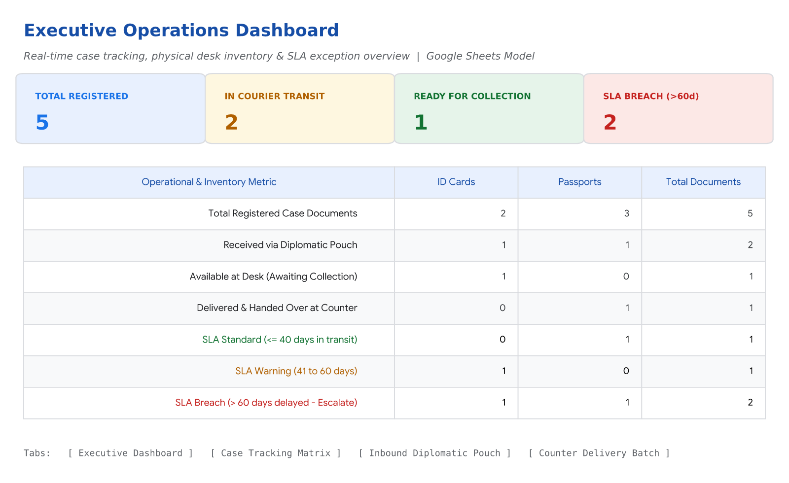

# Consular Operations Suite & Case Tracking Ecosystem (Demo)

An end-to-end, lightweight operational framework designed to resolve citizen intake bottlenecks, automate bilingual communications, and establish proactive SLA case tracking.

---

## 🚀 Live Interactive Web Apps
- **[App 1: Intake & Eligibility Triage](https://caritopagliano.github.io/operations-tracking-demo/)**: Interactive self-service routing to verify prerequisites prior to booking.
- **[App 2: Bilingual Confirmation Generator](https://caritopagliano.github.io/operations-tracking-demo/appointment-email-generator-demo.html)**: 1-click bilingual (UK/ES) email dispatch with exact fee and document checklists.
- **[App 3: Daily Intake Data Normalizer](https://caritopagliano.github.io/operations-tracking-demo/daily-intake-data-normalizer-demo.html)**: Automated stream ingestion and 7-column data hygiene tool with pre-loaded sample data.

---

## 📊 Operations Hub: Spreadsheet & Dashboard Preview

### 🔗 Explore Spreadsheet Model:
- **[Interactive Online Web Viewer](https://view.officeapps.live.com/op/view.aspx?src=https://caritopagliano.github.io/operations-tracking-demo/operations-tracking-matrix-demo.xlsx)** *(Click to view all 4 tabs, formulas and dynamic SLA status flags directly in your browser)*
- **[Download Spreadsheet (.xlsx)](./operations-tracking-matrix-demo.xlsx)** *(Google Sheets / Excel compatible file)*

---

## 📁 Operational Governance & Documentation
- **[Standard Operating Procedure (SOP) Manual (PDF)](./standard-operating-procedure-sop-demo.pdf)**: 1-page visual desk manual standardising workflows across all 4 operational phases.

---

## 🛠️ Core Methodologies & Competencies
- Business Process Improvement (BPI) & Workflow Architecture
- Management by Exception (MBE) & SLA Lifecycle Governance
- AI-Assisted Rapid Tooling & Prompt Engineering (Google AI Professional Certified)
- Standard Operating Procedure (SOP) & Desk Manual Design
